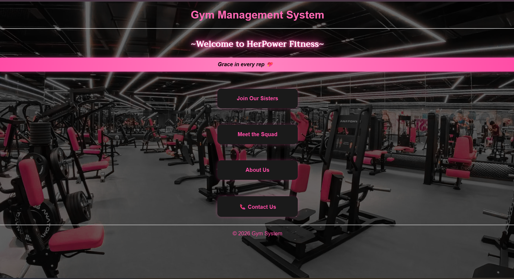
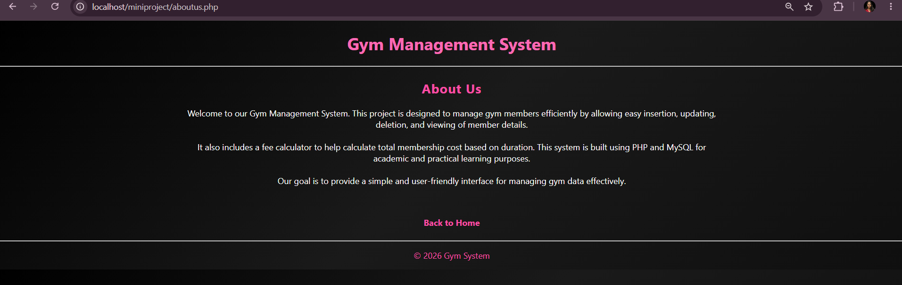
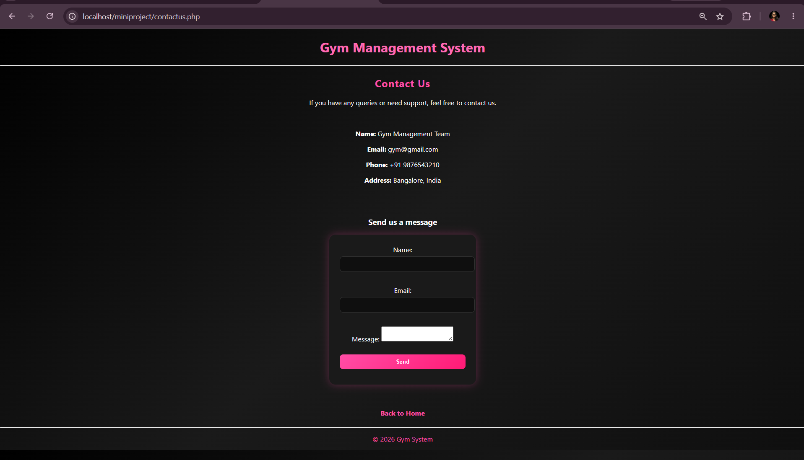
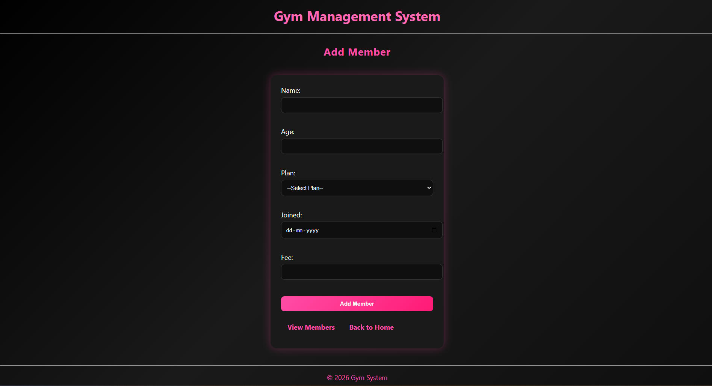
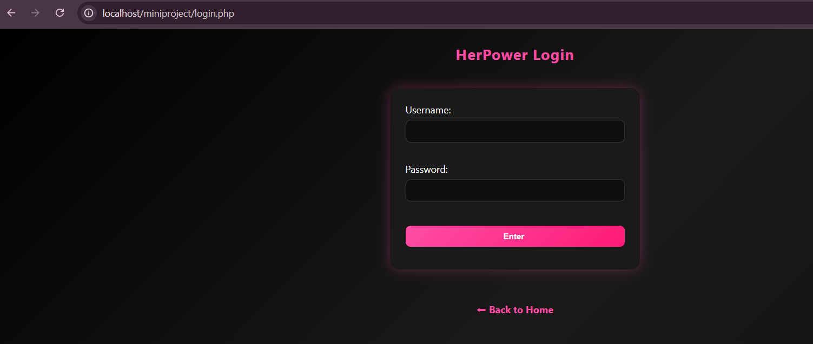
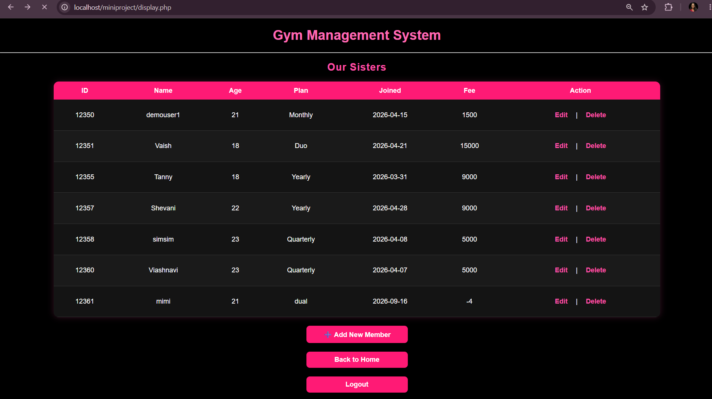

# Gym Management System

A PHP and MariaDB-based Gym Management System that helps manage gym members, registrations, and related records through a simple web interface.

## Features

- Member registration
- Member management
- Database integration with MariaDB
- PHP-based web application
- XAMPP local server support

## Tech Stack

- PHP
- MariaDB
- HTML
- CSS
- JavaScript
- XAMPP

## Project Structure

```text
miniproject/
├── database/
│   └── project.sql
├── admin/
├── css/
├── js/
├── images/
└── ...
```

## How to Run

1. Start **Apache** and **MySQL** in XAMPP.
2. Import `database/project.sql` into MariaDB.
3. Place the project inside `xampp/htdocs/`.
4. Open `http://localhost/miniproject/` in your browser.

## Screenshots

### Home Page


### About Us


### Contact Us


### Registration Form


### Authorization


### Database Table

